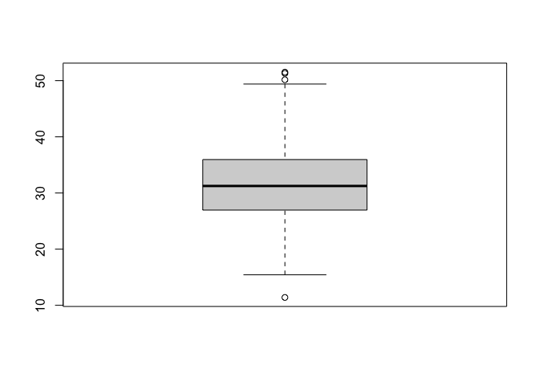
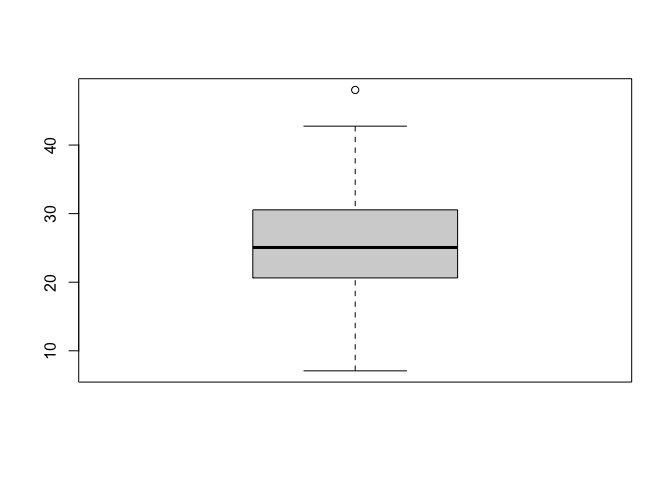
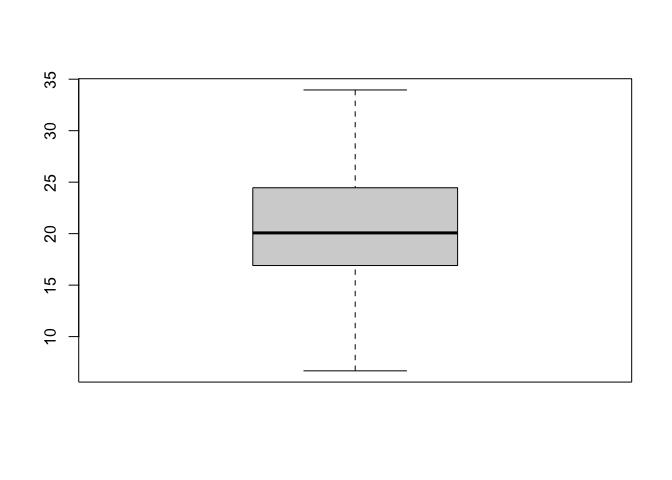
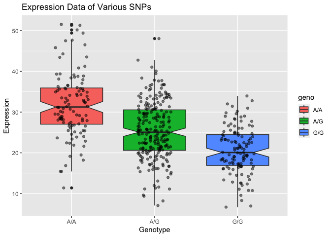

# Class 11 Part 2 Population analysis
Eli Haddad (A16308227)

One sample is obviously not enough to know what is happening in a
population. You are interested in assessing genetic differences on a
population scale. So, you processed about ~230 samples and did the
normalization on a genome level. Now, you want to find whether there is
any association of the 4 asthma-associated SNPs (rs8067378…) on ORMDL3
expression. https://bioboot.github.io/bggn213_W19/class-
material/rs8067378_ENSG00000172057.6.txt This is the final file you got
( column is genotype and the third column are the expression values. ).
The first column is sample name, the second

> Q13: Read this file into R and determine the sample size for each
> genotype and their corresponding median expression levels for each of
> these genotypes

Importing the data

``` r
data <- read.table("rs8067378_ENSG00000172057.6.txt", sep = " ")
head(data)
```

       sample geno      exp
    1 HG00367  A/G 28.96038
    2 NA20768  A/G 20.24449
    3 HG00361  A/A 31.32628
    4 HG00135  A/A 34.11169
    5 NA18870  G/G 18.25141
    6 NA11993  A/A 32.89721

The sample size for each genotype

``` r
table(data$geno)
```


    A/A A/G G/G 
    108 233 121 

Corresponding median expression levels for each of these genotypes

``` r
boxinfo <- boxplot(data[data$geno == "A/A", ]$exp)
```



``` r
medium_val <- boxinfo$stats[3]

medium_val
```

    [1] 31.24847

A/A: 31.24847

``` r
boxinfo <- boxplot(data[data$geno == "A/G", ]$exp)
```



``` r
medium_val <- boxinfo$stats[3]

medium_val
```

    [1] 25.06486

A/G: 25.06486

``` r
boxinfo <- boxplot(data[data$geno == "G/G", ]$exp)
```



``` r
medium_val <- boxinfo$stats[3]

medium_val
```

    [1] 20.07363

G/G: 20.07363

> Q14: Generate a boxplot with a box per genotype, what could you infer
> from the relative expression value between A/A and G/G displayed in
> this plot? Does the SNP effect the expression of ORMDL3?

``` r
library(ggplot2)

ggplot(data, aes(geno,exp)) +
  geom_boxplot(notch=TRUE, aes(fill=geno)) + 
  geom_jitter(width = 0.2, alpha=0.5) +
  labs(title = "Expression Data of Various SNPs", x = "Genotype", y = "Expression")
```



From the boxplot, I can infer that A/A has relatively greater expression
value than G/G, as the median expression of A/A is greater than that of
G/G. Since the notches between the boxplots of A/A and G/G do not
overlap, this difference is statistically different, suggesting that the
SNP does effect the expression of ORMDL3.
