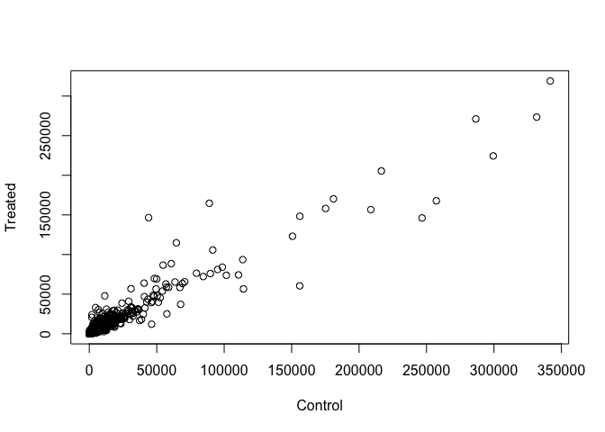
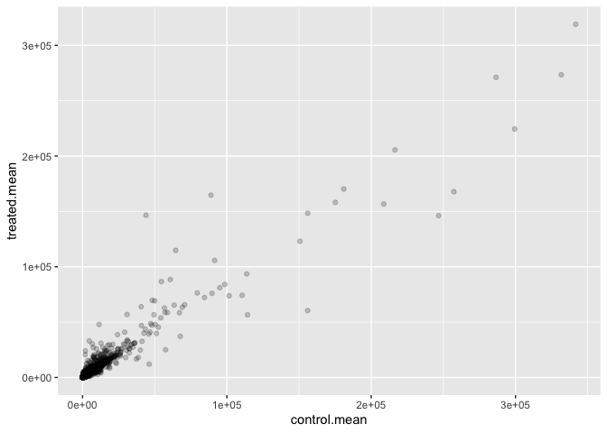
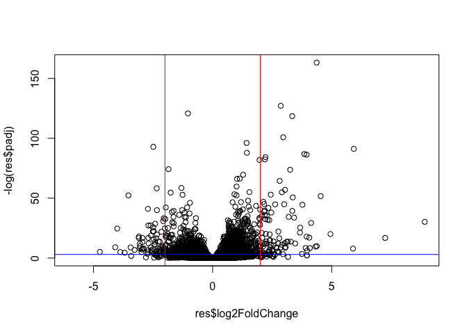
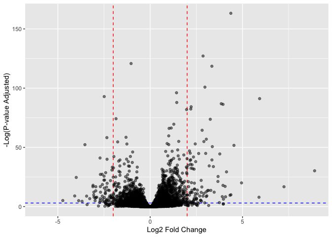

# Class Lab 13
Eli Haddad (A16308227)

The data for this hands-on session comes from a published RNA-seq
experiment where airway smooth muscle cells were treated with
**dexamethasone** (dex), a synthetic glucocorticoid steroid with
anti-inflammatory effects (Himes et al. 2014).

``` r
counts <- read.csv("airway_scaledcounts.csv", row.names=1)
metadata <-  read.csv("airway_metadata.csv")
```

``` r
head(counts)
```

                    SRR1039508 SRR1039509 SRR1039512 SRR1039513 SRR1039516
    ENSG00000000003        723        486        904        445       1170
    ENSG00000000005          0          0          0          0          0
    ENSG00000000419        467        523        616        371        582
    ENSG00000000457        347        258        364        237        318
    ENSG00000000460         96         81         73         66        118
    ENSG00000000938          0          0          1          0          2
                    SRR1039517 SRR1039520 SRR1039521
    ENSG00000000003       1097        806        604
    ENSG00000000005          0          0          0
    ENSG00000000419        781        417        509
    ENSG00000000457        447        330        324
    ENSG00000000460         94        102         74
    ENSG00000000938          0          0          0

``` r
head(metadata)
```

              id     dex celltype     geo_id
    1 SRR1039508 control   N61311 GSM1275862
    2 SRR1039509 treated   N61311 GSM1275863
    3 SRR1039512 control  N052611 GSM1275866
    4 SRR1039513 treated  N052611 GSM1275867
    5 SRR1039516 control  N080611 GSM1275870
    6 SRR1039517 treated  N080611 GSM1275871

> Q1. How many genes are in this dataset?

``` r
nrow(counts)
```

    [1] 38694

> Q2. How many ‘control’ cell lines do we have?

``` r
table(metadata$dex)
```


    control treated 
          4       4 

## 4. Toy differential gene expression

Let’s start by calculating the mean counts per gene in the “control”
samples. We can then compare this value for each gene to the mean counts
in the “treated” samples (i.e. columns).

- Step 1. Find which columns in `counts` correspond to “control”
  samples.
- Step 2. Calculate the mean value epr gene in these columns.
- Step 3. Store my answer for later in `control.mean`

``` r
control <- metadata[metadata$dex=="control",]
control.counts <- counts[ ,control$id]
control.mean <- rowSums(control.counts)/4 
head(control.mean)
```

    ENSG00000000003 ENSG00000000005 ENSG00000000419 ENSG00000000457 ENSG00000000460 
             900.75            0.00          520.50          339.75           97.25 
    ENSG00000000938 
               0.75 

> Q3. How would you make the above code in either approach more robust?
> Is there a function that could help here?

``` r
control.mean <- rowMeans( counts[, metadata$dex=="control"])
head(control.mean)
```

    ENSG00000000003 ENSG00000000005 ENSG00000000419 ENSG00000000457 ENSG00000000460 
             900.75            0.00          520.50          339.75           97.25 
    ENSG00000000938 
               0.75 

A function that can help and make this code more robust is using
`rowMeans`.

> Q4. Follow the same procedure for the treated samples (i.e. calculate
> the mean per gene across drug treated samples and assign to a labeled
> vector called treated.mean)

``` r
treated.mean <- rowMeans( counts[, metadata$dex=="treated"])
head(treated.mean)
```

    ENSG00000000003 ENSG00000000005 ENSG00000000419 ENSG00000000457 ENSG00000000460 
             658.00            0.00          546.00          316.50           78.75 
    ENSG00000000938 
               0.00 

``` r
meancounts <- data.frame(control.mean, treated.mean)

colSums(meancounts)
```

    control.mean treated.mean 
        23005324     22196524 

> Q5 (a). Create a scatter plot showing the mean of the treated samples
> against the mean of the control samples. Your plot should look
> something like the following.

``` r
plot(meancounts$control.mean, meancounts$treated.mean, xlab="Control", ylab="Treated")
```



> Q5 (b).You could also use the ggplot2 package to make this figure
> producing the plot below. What geom\_?() function would you use for
> this plot?

You would use `geom_point` for this.

``` r
library(ggplot2)
ggplot(meancounts, aes(control.mean, treated.mean)) +
  geom_point(alpha=0.2)
```



> Q6. Try plotting both axes on a log scale. What is the argument to
> plot() that allows you to do this?

The argument is `log=xy`.

``` r
plot(meancounts$control.mean, meancounts$treated.mean, xlab="Control", ylab="Treated", log="xy")
```

    Warning in xy.coords(x, y, xlabel, ylabel, log): 15032 x values <= 0 omitted
    from logarithmic plot

    Warning in xy.coords(x, y, xlabel, ylabel, log): 15281 y values <= 0 omitted
    from logarithmic plot


Log transformations are super useful when our data is skewed and
measured over a wide range like this. We can use different log
transformations like base10 or natural logs but we most often prefer
log2 units.

``` r
# Treated / Control
log2(10/10)
```

    [1] 0

What if there was a doubling

``` r
log2(20/10)
```

    [1] 1

What if there was a halfing

``` r
log2(10/20)
```

    [1] -1

4x increase

``` r
log2(40/10)
```

    [1] 2

Lets add a log2 fold-change column to our little `meancounts`
data.frame:

``` r
meancounts$log2fc <- log2(meancounts$treated.mean/meancounts$control.mean)
head(meancounts)
```

                    control.mean treated.mean      log2fc
    ENSG00000000003       900.75       658.00 -0.45303916
    ENSG00000000005         0.00         0.00         NaN
    ENSG00000000419       520.50       546.00  0.06900279
    ENSG00000000457       339.75       316.50 -0.10226805
    ENSG00000000460        97.25        78.75 -0.30441833
    ENSG00000000938         0.75         0.00        -Inf

Hmm. There are a couple of “weird” results. There are a couple of
“weird” results. Namely, the NaN (“not a number”) and -Inf (negative
infinity) results.

``` r
to.rm.inds <- rowSums( meancounts[,1:2] == 0) > 0
mycounts <- meancounts[!to.rm.inds,]
```

The `!` mark flips TRUE values to FALSE and vice-versa…

``` r
x <- c(TRUE,FALSE,TRUE)
!x
```

    [1] FALSE  TRUE FALSE

``` r
dim(mycounts)
```

    [1] 21817     3

``` r
head(mycounts)
```

                    control.mean treated.mean      log2fc
    ENSG00000000003       900.75       658.00 -0.45303916
    ENSG00000000419       520.50       546.00  0.06900279
    ENSG00000000457       339.75       316.50 -0.10226805
    ENSG00000000460        97.25        78.75 -0.30441833
    ENSG00000000971      5219.00      6687.50  0.35769358
    ENSG00000001036      2327.00      1785.75 -0.38194109

> Q7. What is the purpose of the arr.ind argument in the which()
> function call above? Why would we then take the first column of the
> output and need to call the unique() function?

The arr.ind argument is responsible for ensuring that the result is
returned as array indices, an these positions are where there are TRUE
valus. We would then need to call the unique() function bwecause we want
to make sure no two rows are counted twice if they have zero entries in
both.

A common threshold used for calling something differentially expressed
is a log2(FoldChange) of greater than 2 or less than -2. Let’s filter
the dataset both ways to see how many genes are up or down-regulated.

Lets filter the dataset both ways to see how many genes are up or
down-regulated.

``` r
up.ind <- mycounts$log2fc > 2
down.ind <- mycounts$log2fc < (-2)
```

> Q8. Using the up.ind vector above can you determine how many up
> regulated genes we have at the greater than 2 fc level?

``` r
sum(up.ind)
```

    [1] 250

> Q9. Using the down.ind vector above can you determine how many down
> regulated genes we have at the greater than 2 fc level?

``` r
sum(down.ind)
```

    [1] 367

> Q10. Do you trust these results? Why or why not?

I do not trust these results because we have not determined if these up
and down regulations were actually statistically significant.

We forgot all about statistical significantce of these differences…

We will use the DESeq2 package to do the analysis properly…

# Using DESeq2

Like any package we must load it u with a `library()` call.

``` r
library(DESeq2)
```

    Loading required package: S4Vectors

    Warning: package 'S4Vectors' was built under R version 4.3.2

    Loading required package: stats4

    Loading required package: BiocGenerics


    Attaching package: 'BiocGenerics'

    The following objects are masked from 'package:stats':

        IQR, mad, sd, var, xtabs

    The following objects are masked from 'package:base':

        anyDuplicated, aperm, append, as.data.frame, basename, cbind,
        colnames, dirname, do.call, duplicated, eval, evalq, Filter, Find,
        get, grep, grepl, intersect, is.unsorted, lapply, Map, mapply,
        match, mget, order, paste, pmax, pmax.int, pmin, pmin.int,
        Position, rank, rbind, Reduce, rownames, sapply, setdiff, sort,
        table, tapply, union, unique, unsplit, which.max, which.min


    Attaching package: 'S4Vectors'

    The following object is masked from 'package:utils':

        findMatches

    The following objects are masked from 'package:base':

        expand.grid, I, unname

    Loading required package: IRanges

    Loading required package: GenomicRanges

    Loading required package: GenomeInfoDb

    Warning: package 'GenomeInfoDb' was built under R version 4.3.2

    Loading required package: SummarizedExperiment

    Warning: package 'SummarizedExperiment' was built under R version 4.3.2

    Loading required package: MatrixGenerics

    Loading required package: matrixStats


    Attaching package: 'MatrixGenerics'

    The following objects are masked from 'package:matrixStats':

        colAlls, colAnyNAs, colAnys, colAvgsPerRowSet, colCollapse,
        colCounts, colCummaxs, colCummins, colCumprods, colCumsums,
        colDiffs, colIQRDiffs, colIQRs, colLogSumExps, colMadDiffs,
        colMads, colMaxs, colMeans2, colMedians, colMins, colOrderStats,
        colProds, colQuantiles, colRanges, colRanks, colSdDiffs, colSds,
        colSums2, colTabulates, colVarDiffs, colVars, colWeightedMads,
        colWeightedMeans, colWeightedMedians, colWeightedSds,
        colWeightedVars, rowAlls, rowAnyNAs, rowAnys, rowAvgsPerColSet,
        rowCollapse, rowCounts, rowCummaxs, rowCummins, rowCumprods,
        rowCumsums, rowDiffs, rowIQRDiffs, rowIQRs, rowLogSumExps,
        rowMadDiffs, rowMads, rowMaxs, rowMeans2, rowMedians, rowMins,
        rowOrderStats, rowProds, rowQuantiles, rowRanges, rowRanks,
        rowSdDiffs, rowSds, rowSums2, rowTabulates, rowVarDiffs, rowVars,
        rowWeightedMads, rowWeightedMeans, rowWeightedMedians,
        rowWeightedSds, rowWeightedVars

    Loading required package: Biobase

    Welcome to Bioconductor

        Vignettes contain introductory material; view with
        'browseVignettes()'. To cite Bioconductor, see
        'citation("Biobase")', and for packages 'citation("pkgname")'.


    Attaching package: 'Biobase'

    The following object is masked from 'package:MatrixGenerics':

        rowMedians

    The following objects are masked from 'package:matrixStats':

        anyMissing, rowMedians

``` r
dds <- DESeqDataSetFromMatrix(countData=counts, 
                              colData=metadata, 
                              design=~dex)
```

    converting counts to integer mode

    Warning in DESeqDataSet(se, design = design, ignoreRank): some variables in
    design formula are characters, converting to factors

``` r
dds
```

    class: DESeqDataSet 
    dim: 38694 8 
    metadata(1): version
    assays(1): counts
    rownames(38694): ENSG00000000003 ENSG00000000005 ... ENSG00000283120
      ENSG00000283123
    rowData names(0):
    colnames(8): SRR1039508 SRR1039509 ... SRR1039520 SRR1039521
    colData names(4): id dex celltype geo_id

Now we can run our DESeq Analysis

``` r
dds <- DESeq(dds)
```

    estimating size factors

    estimating dispersions

    gene-wise dispersion estimates

    mean-dispersion relationship

    final dispersion estimates

    fitting model and testing

Get our results back from the `dds` object

``` r
res <- results(dds)
head(res)
```

    log2 fold change (MLE): dex treated vs control 
    Wald test p-value: dex treated vs control 
    DataFrame with 6 rows and 6 columns
                      baseMean log2FoldChange     lfcSE      stat    pvalue
                     <numeric>      <numeric> <numeric> <numeric> <numeric>
    ENSG00000000003 747.194195     -0.3507030  0.168246 -2.084470 0.0371175
    ENSG00000000005   0.000000             NA        NA        NA        NA
    ENSG00000000419 520.134160      0.2061078  0.101059  2.039475 0.0414026
    ENSG00000000457 322.664844      0.0245269  0.145145  0.168982 0.8658106
    ENSG00000000460  87.682625     -0.1471420  0.257007 -0.572521 0.5669691
    ENSG00000000938   0.319167     -1.7322890  3.493601 -0.495846 0.6200029
                         padj
                    <numeric>
    ENSG00000000003  0.163035
    ENSG00000000005        NA
    ENSG00000000419  0.176032
    ENSG00000000457  0.961694
    ENSG00000000460  0.815849
    ENSG00000000938        NA

# A summary results plot

Volcano plot. This is a common type of summary figure that keeps both
our inner biologist and inner stats nerd happy because it shows both
P-values and Log2(Fold-Changes).

``` r
plot(res$log2FoldChange, -log(res$padj))
abline(v=2,col="red")
abline(v=-2,col="red")
abline(h=-log(0.05), col="blue")
```



Here’s my attempt at a prettier plot:

``` r
res <- as.data.frame(res)

ggplot(res, aes(log2FoldChange, -log(padj))) +
  geom_vline(xintercept = 2, linetype = "dashed", color = "red") + 
  geom_vline(xintercept = -2, linetype = "dashed", color = "red") + 
  geom_hline(yintercept = -log(0.05), linetype = "dashed", color = "blue") +
  geom_point(alpha = 0.5) +
  xlab("Log2 Fold Change") +
  ylab("-Log(P-value Adjusted)")
```

    Warning: Removed 23549 rows containing missing values (`geom_point()`).



Save our results to date…

``` r
write.csv(res, file="deseq_results.csv")
```

## 8. Adding annotation data

Our result table so far only contains the Ensembl gene IDs. However,
alternative gene names and extra annotation are usually required for
informative interpretation of our results. In this section we will add
this necessary annotation data to our results.

``` r
library("AnnotationDbi")
library("org.Hs.eg.db")
```

``` r
columns(org.Hs.eg.db)
```

     [1] "ACCNUM"       "ALIAS"        "ENSEMBL"      "ENSEMBLPROT"  "ENSEMBLTRANS"
     [6] "ENTREZID"     "ENZYME"       "EVIDENCE"     "EVIDENCEALL"  "GENENAME"    
    [11] "GENETYPE"     "GO"           "GOALL"        "IPI"          "MAP"         
    [16] "OMIM"         "ONTOLOGY"     "ONTOLOGYALL"  "PATH"         "PFAM"        
    [21] "PMID"         "PROSITE"      "REFSEQ"       "SYMBOL"       "UCSCKG"      
    [26] "UNIPROT"     

The main function we will use here is `mapIds()`

Our current Ids are here:

``` r
#mapIds()
head(row.names(res))
```

    [1] "ENSG00000000003" "ENSG00000000005" "ENSG00000000419" "ENSG00000000457"
    [5] "ENSG00000000460" "ENSG00000000938"

These are in ENSEMBLE format. I want “SYMBOL” ids:

``` r
res$symbol <- mapIds(org.Hs.eg.db,
                     keys=row.names(res), # Our genenames
                     keytype="ENSEMBL",   # format of our genenames
                     column="SYMBOL",     # new format we want to add
                     multiVals="first")
```

    'select()' returned 1:many mapping between keys and columns

``` r
head(res)
```

                       baseMean log2FoldChange     lfcSE       stat     pvalue
    ENSG00000000003 747.1941954    -0.35070302 0.1682457 -2.0844697 0.03711747
    ENSG00000000005   0.0000000             NA        NA         NA         NA
    ENSG00000000419 520.1341601     0.20610777 0.1010592  2.0394752 0.04140263
    ENSG00000000457 322.6648439     0.02452695 0.1451451  0.1689823 0.86581056
    ENSG00000000460  87.6826252    -0.14714205 0.2570073 -0.5725210 0.56696907
    ENSG00000000938   0.3191666    -1.73228897 3.4936010 -0.4958463 0.62000288
                         padj symbol
    ENSG00000000003 0.1630348 TSPAN6
    ENSG00000000005        NA   TNMD
    ENSG00000000419 0.1760317   DPM1
    ENSG00000000457 0.9616942  SCYL3
    ENSG00000000460 0.8158486  FIRRM
    ENSG00000000938        NA    FGR

Let’s add GENENAME

``` r
res$genename <- mapIds(org.Hs.eg.db,
                     keys=row.names(res), # Our genenames
                     keytype="ENSEMBL",   # format of our genenames
                     column="GENENAME",     # new format we want to add
                     multiVals="first")
```

    'select()' returned 1:many mapping between keys and columns

``` r
head(res)
```

                       baseMean log2FoldChange     lfcSE       stat     pvalue
    ENSG00000000003 747.1941954    -0.35070302 0.1682457 -2.0844697 0.03711747
    ENSG00000000005   0.0000000             NA        NA         NA         NA
    ENSG00000000419 520.1341601     0.20610777 0.1010592  2.0394752 0.04140263
    ENSG00000000457 322.6648439     0.02452695 0.1451451  0.1689823 0.86581056
    ENSG00000000460  87.6826252    -0.14714205 0.2570073 -0.5725210 0.56696907
    ENSG00000000938   0.3191666    -1.73228897 3.4936010 -0.4958463 0.62000288
                         padj symbol
    ENSG00000000003 0.1630348 TSPAN6
    ENSG00000000005        NA   TNMD
    ENSG00000000419 0.1760317   DPM1
    ENSG00000000457 0.9616942  SCYL3
    ENSG00000000460 0.8158486  FIRRM
    ENSG00000000938        NA    FGR
                                                                       genename
    ENSG00000000003                                               tetraspanin 6
    ENSG00000000005                                                 tenomodulin
    ENSG00000000419 dolichyl-phosphate mannosyltransferase subunit 1, catalytic
    ENSG00000000457                                    SCY1 like pseudokinase 3
    ENSG00000000460   FIGNL1 interacting regulator of recombination and mitosis
    ENSG00000000938              FGR proto-oncogene, Src family tyrosine kinase

Let’s add ENTREZID

``` r
res$entrez <- mapIds(org.Hs.eg.db,
                     keys=row.names(res), # Our genenames
                     keytype="ENSEMBL",   # format of our genenames
                     column="ENTREZID",     # new format we want to add
                     multiVals="first")
```

    'select()' returned 1:many mapping between keys and columns

``` r
head(res)
```

                       baseMean log2FoldChange     lfcSE       stat     pvalue
    ENSG00000000003 747.1941954    -0.35070302 0.1682457 -2.0844697 0.03711747
    ENSG00000000005   0.0000000             NA        NA         NA         NA
    ENSG00000000419 520.1341601     0.20610777 0.1010592  2.0394752 0.04140263
    ENSG00000000457 322.6648439     0.02452695 0.1451451  0.1689823 0.86581056
    ENSG00000000460  87.6826252    -0.14714205 0.2570073 -0.5725210 0.56696907
    ENSG00000000938   0.3191666    -1.73228897 3.4936010 -0.4958463 0.62000288
                         padj symbol
    ENSG00000000003 0.1630348 TSPAN6
    ENSG00000000005        NA   TNMD
    ENSG00000000419 0.1760317   DPM1
    ENSG00000000457 0.9616942  SCYL3
    ENSG00000000460 0.8158486  FIRRM
    ENSG00000000938        NA    FGR
                                                                       genename
    ENSG00000000003                                               tetraspanin 6
    ENSG00000000005                                                 tenomodulin
    ENSG00000000419 dolichyl-phosphate mannosyltransferase subunit 1, catalytic
    ENSG00000000457                                    SCY1 like pseudokinase 3
    ENSG00000000460   FIGNL1 interacting regulator of recombination and mitosis
    ENSG00000000938              FGR proto-oncogene, Src family tyrosine kinase
                    entrez
    ENSG00000000003   7105
    ENSG00000000005  64102
    ENSG00000000419   8813
    ENSG00000000457  57147
    ENSG00000000460  55732
    ENSG00000000938   2268

## Pathway analysis

We will use the **gage** package along with the **pathview** here to do
geneset enrichment (a.k.a pathway analysis) and figure generation
respectively.

``` r
library(pathview)
library(gage)
library(gageData)
```

Lets have a peak at the first two pathways in KEGG

``` r
data(kegg.sets.hs)

# Examine the first 2 pathways in this kegg set for humans
head(kegg.sets.hs, 2)
```

    $`hsa00232 Caffeine metabolism`
    [1] "10"   "1544" "1548" "1549" "1553" "7498" "9"   

    $`hsa00983 Drug metabolism - other enzymes`
     [1] "10"     "1066"   "10720"  "10941"  "151531" "1548"   "1549"   "1551"  
     [9] "1553"   "1576"   "1577"   "1806"   "1807"   "1890"   "221223" "2990"  
    [17] "3251"   "3614"   "3615"   "3704"   "51733"  "54490"  "54575"  "54576" 
    [25] "54577"  "54578"  "54579"  "54600"  "54657"  "54658"  "54659"  "54963" 
    [33] "574537" "64816"  "7083"   "7084"   "7172"   "7363"   "7364"   "7365"  
    [41] "7366"   "7367"   "7371"   "7372"   "7378"   "7498"   "79799"  "83549" 
    [49] "8824"   "8833"   "9"      "978"   

What we need for `gage()` is our genes in ENTREZ id format with a
measure of their importance.

It wants a vector of e.g. fold-changes.

``` r
foldchanges <- res$log2FoldChange
head(foldchanges)
```

    [1] -0.35070302          NA  0.20610777  0.02452695 -0.14714205 -1.73228897

Add ENTREZ ids as `names()` to my `foldchanges` vector.

``` r
names(foldchanges) <- res$entrez
head(foldchanges)
```

           7105       64102        8813       57147       55732        2268 
    -0.35070302          NA  0.20610777  0.02452695 -0.14714205 -1.73228897 

Now we can run the `gage()` with this input vector and the geneset we
want to examine for overlap/enrichment…

``` r
keggres = gage(foldchanges, gsets=kegg.sets.hs)
```

Look at the results

``` r
attributes(keggres)
```

    $names
    [1] "greater" "less"    "stats"  

``` r
head(keggres$less, 3)
```

                                          p.geomean stat.mean        p.val
    hsa05332 Graft-versus-host disease 0.0004250461 -3.473346 0.0004250461
    hsa04940 Type I diabetes mellitus  0.0017820293 -3.002352 0.0017820293
    hsa05310 Asthma                    0.0020045888 -3.009050 0.0020045888
                                            q.val set.size         exp1
    hsa05332 Graft-versus-host disease 0.09053483       40 0.0004250461
    hsa04940 Type I diabetes mellitus  0.14232581       42 0.0017820293
    hsa05310 Asthma                    0.14232581       29 0.0020045888

We can view these pathways with our geneset genes highlighted using the
`pathview()` function. E.g. for “Asthma” I will use the pathway.id
hsa05310 as seen above.

``` r
pathview(gene.data=foldchanges, pathway.id="hsa05310")
```

    'select()' returned 1:1 mapping between keys and columns

    Info: Working in directory /Users/eh/Desktop/BIMM143/bimm143_github/Class13

    Info: Writing image file hsa05310.pathview.png


