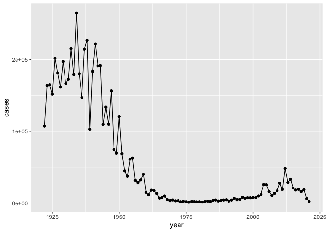
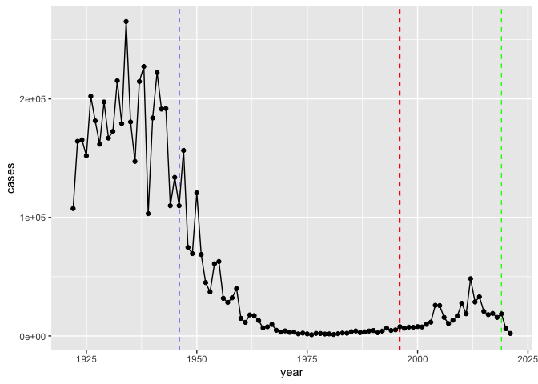
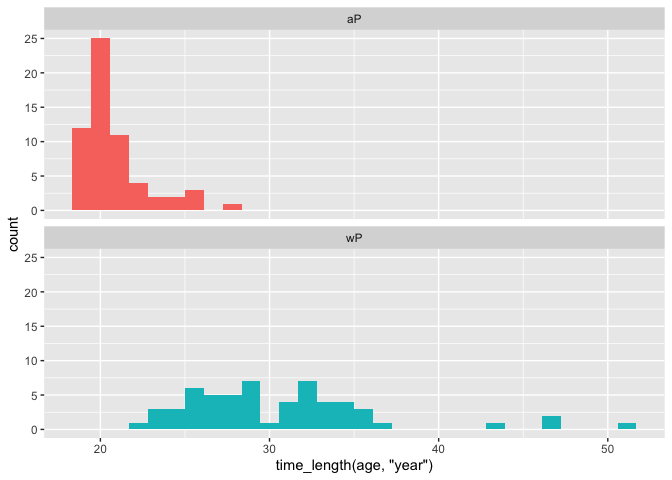
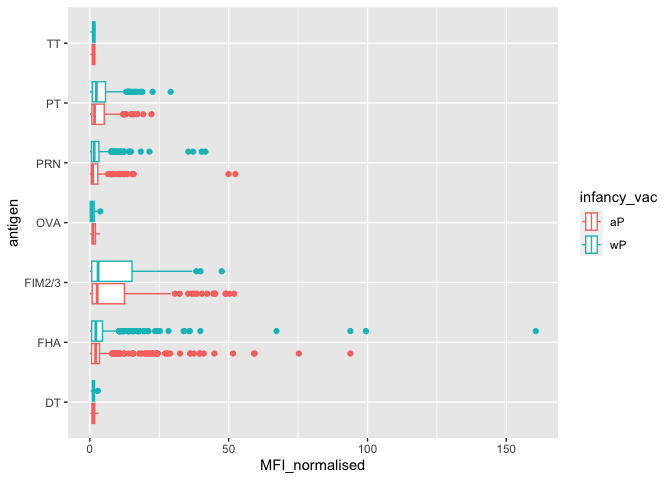

# Class 19: Pertussis and the CMI-PB Project
Eli Haddad (A16308227)

Pertussis is a severe lung infection often also known as whooping cough

We wil begin by investigating the number of Pertussis cases per year in
the US.

This data is available on the CDC webste here
[here](https://www.cdc.gov/pertussis/surv-reporting/cases-by-year.html)

Lets have a wee look at this data.frame

``` r
head(cdc)
```

      year  cases
    1 1922 107473
    2 1923 164191
    3 1924 165418
    4 1925 152003
    5 1926 202210
    6 1927 181411

> Q1. With the help of the R “addin” package datapasta assign the CDC
> pertussis case number data to a data frame called cdc and use ggplot
> to make a plot of cases numbers over time.

I want a nice plot of the number of cases per year.

``` r
library(ggplot2)

ggplot(cdc, aes(year, cases)) +
  geom_point() +
  geom_line()
```



# 2. A table of two vaccines (wP & aP)

> Q2. Using the ggplot geom_vline() function add lines to your previous
> plot for the 1946 introduction of the wP vaccine and the 1996 switch
> to aP vaccine (see example in the hint below). What do you notice?

``` r
ggplot(cdc, aes(year, cases)) +
  geom_vline(xintercept=1946, linetype="dashed", col="blue") +
  geom_vline(xintercept=1996, linetype ="dashed", col="red") +
  geom_vline(xintercept=2019, linetype ="dashed", col="green") +
  geom_point() +
  geom_line()
```



I notice that usage of the wP vaccine led to decrease of cases and no
resurgence. However, when the switch to aP vaccines took place, cases
started to resurge moderately.

> Q3. Describe what happened after the introduction of the aP vaccine?
> Do you have a possible explanation for the observed trend?

After addition of the aP vaccine, there is a lag and then cases rise
with a ~3 year cycle perhaps similar to that observed before to the
first wP introduction.

# 3. Exploring CMI-PB data

Why is this vaccine-preventable disease on the upswing? To answer this
question we need to invetigate the mechanisms underlying waning
protection against pertussis. This required evaluation of
pertussis-specific immune responses over time in wP and aP vaccinated
individuals.

This is the goals of the CMI-PB project: https://www.cmi-pb.org/

The CMI-PB project makes its data avilable via “API-endpoint” that
return JSON format.

We will use the **jsonlite** package to access this data. The main
function in this package is called `read_json()`

``` r
library(jsonlite)

# Subject table
subject <- read_json("https://www.cmi-pb.org/api/subject", simplifyVector=TRUE)
specimen <- read_json("https://www.cmi-pb.org/api/specimen", simplifyVector=TRUE)
titer <- read_json("https://www.cmi-pb.org/api/plasma_ab_titer", simplifyVector=TRUE)
```

Have a wee peak at these new objects:

``` r
head(subject)
```

      subject_id infancy_vac biological_sex              ethnicity  race
    1          1          wP         Female Not Hispanic or Latino White
    2          2          wP         Female Not Hispanic or Latino White
    3          3          wP         Female                Unknown White
    4          4          wP           Male Not Hispanic or Latino Asian
    5          5          wP           Male Not Hispanic or Latino Asian
    6          6          wP         Female Not Hispanic or Latino White
      year_of_birth date_of_boost      dataset
    1    1986-01-01    2016-09-12 2020_dataset
    2    1968-01-01    2019-01-28 2020_dataset
    3    1983-01-01    2016-10-10 2020_dataset
    4    1988-01-01    2016-08-29 2020_dataset
    5    1991-01-01    2016-08-29 2020_dataset
    6    1988-01-01    2016-10-10 2020_dataset

``` r
head(titer)
```

      specimen_id isotype is_antigen_specific antigen        MFI MFI_normalised
    1           1     IgE               FALSE   Total 1110.21154       2.493425
    2           1     IgE               FALSE   Total 2708.91616       2.493425
    3           1     IgG                TRUE      PT   68.56614       3.736992
    4           1     IgG                TRUE     PRN  332.12718       2.602350
    5           1     IgG                TRUE     FHA 1887.12263      34.050956
    6           1     IgE                TRUE     ACT    0.10000       1.000000
       unit lower_limit_of_detection
    1 UG/ML                 2.096133
    2 IU/ML                29.170000
    3 IU/ML                 0.530000
    4 IU/ML                 6.205949
    5 IU/ML                 4.679535
    6 IU/ML                 2.816431

> Q4. How may aP and wP infancy vaccinated subjects are in the dataset?

``` r
table(subject$infancy_vac)
```


    aP wP 
    60 58 

> Q5. How many Male and Female subjects/patients are in the dataset?

``` r
table(subject$biological_sex)
```


    Female   Male 
        79     39 

> Q6. What is the breakdown of race and biological sex (e.g. number of
> Asian females, White males etc…)?

``` r
table(subject$biological_sex, subject$race)
```

            
             American Indian/Alaska Native Asian Black or African American
      Female                             0    21                         2
      Male                               1    11                         0
            
             More Than One Race Native Hawaiian or Other Pacific Islander
      Female                  9                                         1
      Male                    2                                         1
            
             Unknown or Not Reported White
      Female                      11    35
      Male                         4    20

Now add the age of each subject to the subject table.

``` r
subject$age <- ymd(subject$date_of_boost) - ymd(subject$year_of_birth)
subject$age_years <- time_length(subject$age, "years")
head(subject)
```

      subject_id infancy_vac biological_sex              ethnicity  race
    1          1          wP         Female Not Hispanic or Latino White
    2          2          wP         Female Not Hispanic or Latino White
    3          3          wP         Female                Unknown White
    4          4          wP           Male Not Hispanic or Latino Asian
    5          5          wP           Male Not Hispanic or Latino Asian
    6          6          wP         Female Not Hispanic or Latino White
      year_of_birth date_of_boost      dataset        age age_years
    1    1986-01-01    2016-09-12 2020_dataset 11212 days  30.69678
    2    1968-01-01    2019-01-28 2020_dataset 18655 days  51.07461
    3    1983-01-01    2016-10-10 2020_dataset 12336 days  33.77413
    4    1988-01-01    2016-08-29 2020_dataset 10468 days  28.65982
    5    1991-01-01    2016-08-29 2020_dataset  9372 days  25.65914
    6    1988-01-01    2016-10-10 2020_dataset 10510 days  28.77481

> Q7. Using this approach determine (i) the average age of wP
> individuals, (ii) the average age of aP individuals; and (iii) are
> they significantly different?

``` r
library(dplyr)

ap <- subject %>% filter(infancy_vac == "aP")
round(summary(time_length(ap$age,"years")))
```

       Min. 1st Qu.  Median    Mean 3rd Qu.    Max. 
         19      20      20      21      21      28 

``` r
wp <- subject %>% filter(infancy_vac == "wP")
round(summary(time_length(wp$age, "years" )))  
```

       Min. 1st Qu.  Median    Mean 3rd Qu.    Max. 
         23      26      29      31      34      51 

> Q8. Determine the age of all individuals at time of boost?

``` r
int <- ymd(subject$date_of_boost) - ymd(subject$year_of_birth)
age_at_boost <- time_length(int, "year")
head(age_at_boost)
```

    [1] 30.69678 51.07461 33.77413 28.65982 25.65914 28.77481

> Q9. With the help of a faceted boxplot (see below), do you think these
> two groups are significantly different?

``` r
ggplot(subject) +
  aes(time_length(age, "year"),
      fill=as.factor(infancy_vac)) +
  geom_histogram(show.legend=FALSE) +
  facet_wrap(vars(infancy_vac), nrow=2) 
```

    `stat_bin()` using `bins = 30`. Pick better value with `binwidth`.



# Merge or join tables

> Q9. Complete the code to join specimen and subject tables to make a
> new merged data frame containing all specimen records along with their
> associated subject details:

``` r
library(dplyr)
meta <- inner_join(specimen, subject)
```

    Joining with `by = join_by(subject_id)`

``` r
head(meta)
```

      specimen_id subject_id actual_day_relative_to_boost
    1           1          1                           -3
    2           2          1                            1
    3           3          1                            3
    4           4          1                            7
    5           5          1                           11
    6           6          1                           32
      planned_day_relative_to_boost specimen_type visit infancy_vac biological_sex
    1                             0         Blood     1          wP         Female
    2                             1         Blood     2          wP         Female
    3                             3         Blood     3          wP         Female
    4                             7         Blood     4          wP         Female
    5                            14         Blood     5          wP         Female
    6                            30         Blood     6          wP         Female
                   ethnicity  race year_of_birth date_of_boost      dataset
    1 Not Hispanic or Latino White    1986-01-01    2016-09-12 2020_dataset
    2 Not Hispanic or Latino White    1986-01-01    2016-09-12 2020_dataset
    3 Not Hispanic or Latino White    1986-01-01    2016-09-12 2020_dataset
    4 Not Hispanic or Latino White    1986-01-01    2016-09-12 2020_dataset
    5 Not Hispanic or Latino White    1986-01-01    2016-09-12 2020_dataset
    6 Not Hispanic or Latino White    1986-01-01    2016-09-12 2020_dataset
             age age_years
    1 11212 days  30.69678
    2 11212 days  30.69678
    3 11212 days  30.69678
    4 11212 days  30.69678
    5 11212 days  30.69678
    6 11212 days  30.69678

Antibody measurements in the blood

> Q10. Now using the same procedure join meta with titer data so we can
> further analyze this data in terms of time of visit aP/wP, male/female
> etc.

``` r
abdata <- inner_join(titer, meta)
```

    Joining with `by = join_by(specimen_id)`

``` r
head(abdata)
```

      specimen_id isotype is_antigen_specific antigen        MFI MFI_normalised
    1           1     IgE               FALSE   Total 1110.21154       2.493425
    2           1     IgE               FALSE   Total 2708.91616       2.493425
    3           1     IgG                TRUE      PT   68.56614       3.736992
    4           1     IgG                TRUE     PRN  332.12718       2.602350
    5           1     IgG                TRUE     FHA 1887.12263      34.050956
    6           1     IgE                TRUE     ACT    0.10000       1.000000
       unit lower_limit_of_detection subject_id actual_day_relative_to_boost
    1 UG/ML                 2.096133          1                           -3
    2 IU/ML                29.170000          1                           -3
    3 IU/ML                 0.530000          1                           -3
    4 IU/ML                 6.205949          1                           -3
    5 IU/ML                 4.679535          1                           -3
    6 IU/ML                 2.816431          1                           -3
      planned_day_relative_to_boost specimen_type visit infancy_vac biological_sex
    1                             0         Blood     1          wP         Female
    2                             0         Blood     1          wP         Female
    3                             0         Blood     1          wP         Female
    4                             0         Blood     1          wP         Female
    5                             0         Blood     1          wP         Female
    6                             0         Blood     1          wP         Female
                   ethnicity  race year_of_birth date_of_boost      dataset
    1 Not Hispanic or Latino White    1986-01-01    2016-09-12 2020_dataset
    2 Not Hispanic or Latino White    1986-01-01    2016-09-12 2020_dataset
    3 Not Hispanic or Latino White    1986-01-01    2016-09-12 2020_dataset
    4 Not Hispanic or Latino White    1986-01-01    2016-09-12 2020_dataset
    5 Not Hispanic or Latino White    1986-01-01    2016-09-12 2020_dataset
    6 Not Hispanic or Latino White    1986-01-01    2016-09-12 2020_dataset
             age age_years
    1 11212 days  30.69678
    2 11212 days  30.69678
    3 11212 days  30.69678
    4 11212 days  30.69678
    5 11212 days  30.69678
    6 11212 days  30.69678

> Q11. How many specimens (i.e. entries in abdata) do we have for each
> isotype?

``` r
table(abdata$isotype)
```


     IgE  IgG IgG1 IgG2 IgG3 IgG4 
    6698 3240 7968 7968 7968 7968 

Lets focus on on of these: IgG

``` r
igg <- abdata %>% filter(isotype =="IgG")
head(igg)
```

      specimen_id isotype is_antigen_specific antigen        MFI MFI_normalised
    1           1     IgG                TRUE      PT   68.56614       3.736992
    2           1     IgG                TRUE     PRN  332.12718       2.602350
    3           1     IgG                TRUE     FHA 1887.12263      34.050956
    4          19     IgG                TRUE      PT   20.11607       1.096366
    5          19     IgG                TRUE     PRN  976.67419       7.652635
    6          19     IgG                TRUE     FHA   60.76626       1.096457
       unit lower_limit_of_detection subject_id actual_day_relative_to_boost
    1 IU/ML                 0.530000          1                           -3
    2 IU/ML                 6.205949          1                           -3
    3 IU/ML                 4.679535          1                           -3
    4 IU/ML                 0.530000          3                           -3
    5 IU/ML                 6.205949          3                           -3
    6 IU/ML                 4.679535          3                           -3
      planned_day_relative_to_boost specimen_type visit infancy_vac biological_sex
    1                             0         Blood     1          wP         Female
    2                             0         Blood     1          wP         Female
    3                             0         Blood     1          wP         Female
    4                             0         Blood     1          wP         Female
    5                             0         Blood     1          wP         Female
    6                             0         Blood     1          wP         Female
                   ethnicity  race year_of_birth date_of_boost      dataset
    1 Not Hispanic or Latino White    1986-01-01    2016-09-12 2020_dataset
    2 Not Hispanic or Latino White    1986-01-01    2016-09-12 2020_dataset
    3 Not Hispanic or Latino White    1986-01-01    2016-09-12 2020_dataset
    4                Unknown White    1983-01-01    2016-10-10 2020_dataset
    5                Unknown White    1983-01-01    2016-10-10 2020_dataset
    6                Unknown White    1983-01-01    2016-10-10 2020_dataset
             age age_years
    1 11212 days  30.69678
    2 11212 days  30.69678
    3 11212 days  30.69678
    4 12336 days  33.77413
    5 12336 days  33.77413
    6 12336 days  33.77413

Box plot of MFI_normalised vs antigen

``` r
ggplot(igg, aes(MFI_normalised, antigen, col=infancy_vac)) +
  geom_boxplot()
```



``` r
head(igg)
```

      specimen_id isotype is_antigen_specific antigen        MFI MFI_normalised
    1           1     IgG                TRUE      PT   68.56614       3.736992
    2           1     IgG                TRUE     PRN  332.12718       2.602350
    3           1     IgG                TRUE     FHA 1887.12263      34.050956
    4          19     IgG                TRUE      PT   20.11607       1.096366
    5          19     IgG                TRUE     PRN  976.67419       7.652635
    6          19     IgG                TRUE     FHA   60.76626       1.096457
       unit lower_limit_of_detection subject_id actual_day_relative_to_boost
    1 IU/ML                 0.530000          1                           -3
    2 IU/ML                 6.205949          1                           -3
    3 IU/ML                 4.679535          1                           -3
    4 IU/ML                 0.530000          3                           -3
    5 IU/ML                 6.205949          3                           -3
    6 IU/ML                 4.679535          3                           -3
      planned_day_relative_to_boost specimen_type visit infancy_vac biological_sex
    1                             0         Blood     1          wP         Female
    2                             0         Blood     1          wP         Female
    3                             0         Blood     1          wP         Female
    4                             0         Blood     1          wP         Female
    5                             0         Blood     1          wP         Female
    6                             0         Blood     1          wP         Female
                   ethnicity  race year_of_birth date_of_boost      dataset
    1 Not Hispanic or Latino White    1986-01-01    2016-09-12 2020_dataset
    2 Not Hispanic or Latino White    1986-01-01    2016-09-12 2020_dataset
    3 Not Hispanic or Latino White    1986-01-01    2016-09-12 2020_dataset
    4                Unknown White    1983-01-01    2016-10-10 2020_dataset
    5                Unknown White    1983-01-01    2016-10-10 2020_dataset
    6                Unknown White    1983-01-01    2016-10-10 2020_dataset
             age age_years
    1 11212 days  30.69678
    2 11212 days  30.69678
    3 11212 days  30.69678
    4 12336 days  33.77413
    5 12336 days  33.77413
    6 12336 days  33.77413

Focus in on IgG to the Pertussis Toxin (PT) antigen in the 2021 dataset

``` r
igg.pt <- igg %>% filter(antigen == "PT", dataset == "2021_dataset")
```

``` r
ggplot(igg.pt) +
  aes(planned_day_relative_to_boost, 
      MFI_normalised, 
      col=infancy_vac, 
      group=subject_id) + 
  geom_point() +
  geom_line() +
  geom_vline(xintercept= 0, linetype="dashed", col="black") + 
  geom_vline(xintercept= 14, linetype="dashed", col="black")
```


