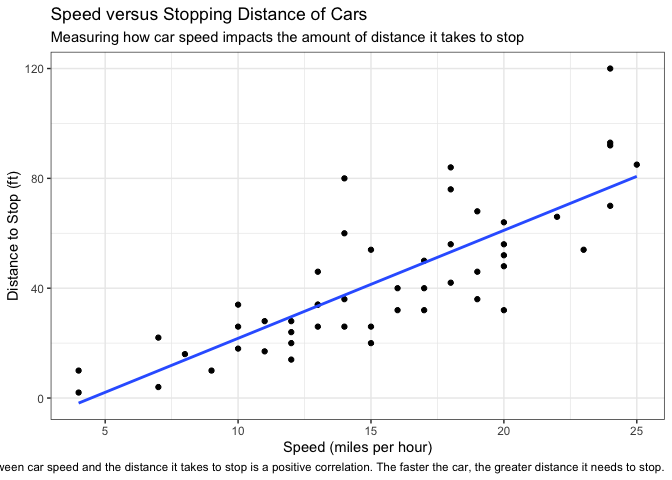
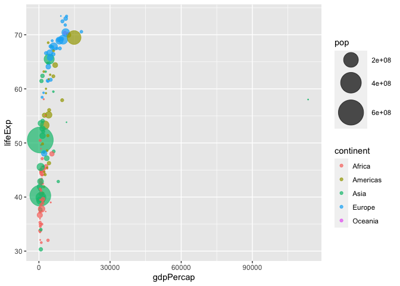
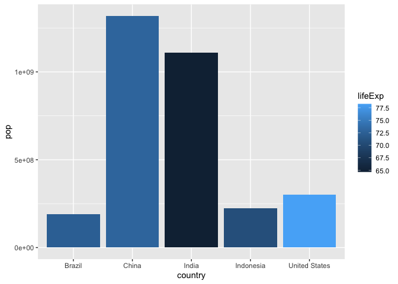

# Class 5 Data Visualization with ggplot2
Eli Haddad (PID: A16308227)

## Using GGPLOT

The ggplot2 package needs to be installed as it does not come with R
“out of the box”

We have to use the `install.packages()` function to install ggplot2

``` r
head(cars)
```

      speed dist
    1     4    2
    2     4   10
    3     7    4
    4     7   22
    5     8   16
    6     9   10

To use ggplot I need to load it up before I can call any of the
functions in the package. I do this with the `library()` function.

``` r
#install.packages("ggplot2")
library(ggplot2)
ggplot()
```


All ggplot figures have at least 3 things: - data (the stuff we want to
plot) - aesthetics mapping (aes vales) - geoms

``` r
ggplot(cars) +
  aes(x=speed, y=dist) +
  geom_point()
```


ggplot is not the only graphing system in R there are lots of others.
There is even “base R” graphics.

``` r
plot(cars)
```


``` r
ggplot(cars) +
  aes(x=speed, y=dist) +
  geom_point() +
  geom_smooth(method = "lm", se = FALSE) + 
  labs(title = "Speed versus Stopping Distance of Cars",
       x ="Speed (miles per hour)",
       y ="Distance to Stop (ft)",
       subtitle = "Measuring how car speed impacts the amount of distance it takes to stop",
       caption = "The relationship between car speed and the distance it takes to stop is a positive correlation. The faster the car, the greater distance it needs to stop.") +
  theme_bw()
```

    `geom_smooth()` using formula = 'y ~ x'



``` r
url <- "https://bioboot.github.io/bimm143_S20/class-material/up_down_expression.txt"
genes <- read.delim(url)
head(genes)
```

            Gene Condition1 Condition2      State
    1      A4GNT -3.6808610 -3.4401355 unchanging
    2       AAAS  4.5479580  4.3864126 unchanging
    3      AASDH  3.7190695  3.4787276 unchanging
    4       AATF  5.0784720  5.0151916 unchanging
    5       AATK  0.4711421  0.5598642 unchanging
    6 AB015752.4 -3.6808610 -3.5921390 unchanging

Number of genes in the dataset:

``` r
nrow(genes)
```

    [1] 5196

The column names and number of columns in the dataset, respectively:

``` r
colnames(genes)
```

    [1] "Gene"       "Condition1" "Condition2" "State"     

``` r
ncol(genes)
```

    [1] 4

Tabulated “State” of genes

``` r
table(genes$State)
```


          down unchanging         up 
            72       4997        127 

Fraction of genes up-regulated in this dataset

``` r
round(table(genes$State)/nrow(genes) * 100, 2)
```


          down unchanging         up 
          1.39      96.17       2.44 

``` r
ggplot(genes) + 
  aes(x=Condition1, y=Condition2) + 
  geom_point()
```


``` r
p <- ggplot(genes) + 
    aes(x=Condition1, y=Condition2, col=State) +
    geom_point()
p + scale_colour_manual( values=c("blue","gray","red") ) +
  labs(title="Gene Expression Changes Upon Drug Treatment",
       x="Control (no drug)",
       y="Drug Treatment")
```


Section 7

``` r
#install.packages("gapminder")
#install.packages("dplyr")
library(gapminder)
library(dplyr)
```


    Attaching package: 'dplyr'

    The following objects are masked from 'package:stats':

        filter, lag

    The following objects are masked from 'package:base':

        intersect, setdiff, setequal, union

``` r
gapminder_2007 <- gapminder %>% filter(year==2007)

ggplot(gapminder_2007) +
  aes(x=gdpPercap, y=lifeExp, color=continent, size = pop) +
  geom_point(alpha=0.5)
```


``` r
ggplot(gapminder_2007) + 
  aes(x = gdpPercap, y = lifeExp, size = pop) +
  geom_point(alpha=0.5) +
  scale_size_area(max_size=10)
```


``` r
gapminder_1957 <- gapminder %>% filter(year==1957)
ggplot(gapminder_1957) +
  aes(x=gdpPercap, y=lifeExp, color = continent, size =pop) + 
  geom_point(alpha=0.7) +
  scale_size_area(max_size = 15)
```



``` r
gapminder_1957 <- gapminder %>% filter(year==1957 | year == 2007)
ggplot(gapminder_1957) +
  aes(x=gdpPercap, y=lifeExp, color = continent, size =pop) + 
  geom_point(alpha=0.7) +
  scale_size_area(max_size = 15) + 
  facet_wrap(~year)
```


Section 8

``` r
gapminder_top5 <- gapminder %>% 
  filter(year==2007) %>% 
  arrange(desc(pop)) %>% 
  top_n(5, pop)

gapminder_top5
```

    # A tibble: 5 × 6
      country       continent  year lifeExp        pop gdpPercap
      <fct>         <fct>     <int>   <dbl>      <int>     <dbl>
    1 China         Asia       2007    73.0 1318683096     4959.
    2 India         Asia       2007    64.7 1110396331     2452.
    3 United States Americas   2007    78.2  301139947    42952.
    4 Indonesia     Asia       2007    70.6  223547000     3541.
    5 Brazil        Americas   2007    72.4  190010647     9066.

Country by Population

``` r
ggplot(gapminder_top5) + 
  geom_col(aes(x = country, y = pop))
```


Country by Life Expectancy

``` r
ggplot(gapminder_top5) + 
  geom_col(aes(x = country, y = lifeExp))
```


Country by Population with color

``` r
ggplot(gapminder_top5) + 
  geom_col(aes(x = country, y = pop, fill = continent))
```


Country by Population but with color based on life expectancy

``` r
ggplot(gapminder_top5) + 
  geom_col(aes(x = country, y = pop, fill=lifeExp))
```



``` r
ggplot(gapminder_top5) +
  aes(x=reorder(country, -pop), y=pop, fill=country) +
  geom_col(col="gray30") +
  guides(fill="none")
```


Flipping Bar Charts

``` r
head(USArrests)
```

               Murder Assault UrbanPop Rape
    Alabama      13.2     236       58 21.2
    Alaska       10.0     263       48 44.5
    Arizona       8.1     294       80 31.0
    Arkansas      8.8     190       50 19.5
    California    9.0     276       91 40.6
    Colorado      7.9     204       78 38.7

``` r
USArrests$State <- rownames(USArrests)
ggplot(USArrests) +
  aes(x=reorder(State,Murder), y=Murder) +
  geom_point() +
  geom_segment(aes(x=State, 
                   xend=State, 
                   y=0, 
                   yend=Murder), color="blue") +
  coord_flip()
```


Animation

``` r
#install.packages("gapminder")
#install.packages("gganimate")
# library(gapminder)
# library(gganimate)
# 
# 
# ggplot(gapminder, aes(gdpPercap, lifeExp, size = pop, colour = country)) +
#   geom_point(alpha = 0.7, show.legend = FALSE) +
#   scale_colour_manual(values = country_colors) +
#   scale_size(range = c(2, 12)) +
#   scale_x_log10() +
#   facet_wrap(~continent) +
#   labs(title = 'Year: {frame_time}', x = 'GDP per capita', y = 'life expectancy') +
#   transition_time(year) +
#   shadow_wake(wake_length = 0.1, alpha = FALSE)
```

Combining Plots

``` r
#install.packages("patchwork")
library(patchwork)

p1 <- ggplot(mtcars) + geom_point(aes(mpg, disp))
p2 <- ggplot(mtcars) + geom_boxplot(aes(gear, disp, group = gear))
p3 <- ggplot(mtcars) + geom_smooth(aes(disp, qsec))
p4 <- ggplot(mtcars) + geom_bar(aes(carb))
(p1 | p2 | p3) /
      p4
```

    `geom_smooth()` using method = 'loess' and formula = 'y ~ x'


