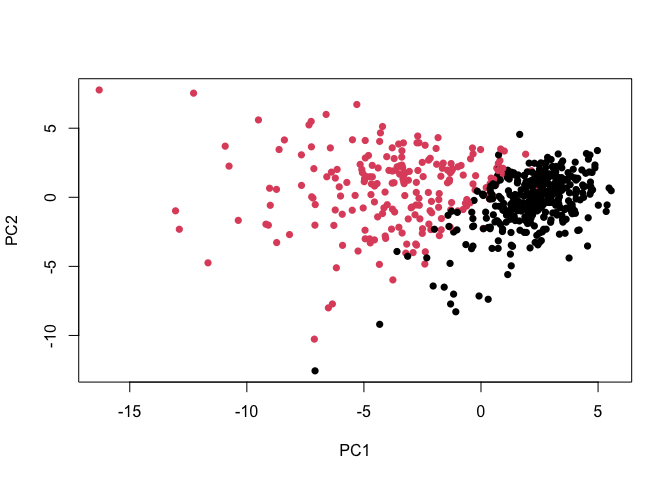
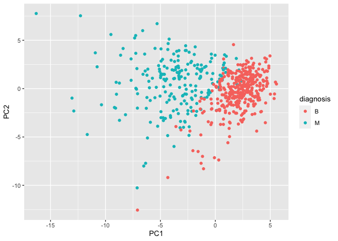

# Class 8: Mini Project
Eli Haddad (A16308227)

Today we will apply the machine learning methods we introduced in the
last class on breast cancer biopsy data from fine needle aspiration
(FNA).

## Data input

The data is supplied on CSV format:

``` r
fna.data <- "WisconsinCancer.csv"
wisc.df <- read.csv(fna.data, row.names=1)

head(wisc.df)
```

             diagnosis radius_mean texture_mean perimeter_mean area_mean
    842302           M       17.99        10.38         122.80    1001.0
    842517           M       20.57        17.77         132.90    1326.0
    84300903         M       19.69        21.25         130.00    1203.0
    84348301         M       11.42        20.38          77.58     386.1
    84358402         M       20.29        14.34         135.10    1297.0
    843786           M       12.45        15.70          82.57     477.1
             smoothness_mean compactness_mean concavity_mean concave.points_mean
    842302           0.11840          0.27760         0.3001             0.14710
    842517           0.08474          0.07864         0.0869             0.07017
    84300903         0.10960          0.15990         0.1974             0.12790
    84348301         0.14250          0.28390         0.2414             0.10520
    84358402         0.10030          0.13280         0.1980             0.10430
    843786           0.12780          0.17000         0.1578             0.08089
             symmetry_mean fractal_dimension_mean radius_se texture_se perimeter_se
    842302          0.2419                0.07871    1.0950     0.9053        8.589
    842517          0.1812                0.05667    0.5435     0.7339        3.398
    84300903        0.2069                0.05999    0.7456     0.7869        4.585
    84348301        0.2597                0.09744    0.4956     1.1560        3.445
    84358402        0.1809                0.05883    0.7572     0.7813        5.438
    843786          0.2087                0.07613    0.3345     0.8902        2.217
             area_se smoothness_se compactness_se concavity_se concave.points_se
    842302    153.40      0.006399        0.04904      0.05373           0.01587
    842517     74.08      0.005225        0.01308      0.01860           0.01340
    84300903   94.03      0.006150        0.04006      0.03832           0.02058
    84348301   27.23      0.009110        0.07458      0.05661           0.01867
    84358402   94.44      0.011490        0.02461      0.05688           0.01885
    843786     27.19      0.007510        0.03345      0.03672           0.01137
             symmetry_se fractal_dimension_se radius_worst texture_worst
    842302       0.03003             0.006193        25.38         17.33
    842517       0.01389             0.003532        24.99         23.41
    84300903     0.02250             0.004571        23.57         25.53
    84348301     0.05963             0.009208        14.91         26.50
    84358402     0.01756             0.005115        22.54         16.67
    843786       0.02165             0.005082        15.47         23.75
             perimeter_worst area_worst smoothness_worst compactness_worst
    842302            184.60     2019.0           0.1622            0.6656
    842517            158.80     1956.0           0.1238            0.1866
    84300903          152.50     1709.0           0.1444            0.4245
    84348301           98.87      567.7           0.2098            0.8663
    84358402          152.20     1575.0           0.1374            0.2050
    843786            103.40      741.6           0.1791            0.5249
             concavity_worst concave.points_worst symmetry_worst
    842302            0.7119               0.2654         0.4601
    842517            0.2416               0.1860         0.2750
    84300903          0.4504               0.2430         0.3613
    84348301          0.6869               0.2575         0.6638
    84358402          0.4000               0.1625         0.2364
    843786            0.5355               0.1741         0.3985
             fractal_dimension_worst
    842302                   0.11890
    842517                   0.08902
    84300903                 0.08758
    84348301                 0.17300
    84358402                 0.07678
    843786                   0.12440

Now I will store the diagnosis column for later and exclude it from the
data set I will actually do things with that I will call `wisc.data`

``` r
diagnosis <- as.factor(wisc.df$diagnosis)
wisc.data <- wisc.df[,-1]
```

> Q1. How many observations are in this dataset?

``` r
nrow(wisc.data)
```

    [1] 569

> Q2. How many of the observations have a malignant diagnosis?

``` r
table(wisc.df$diagnosis)
```


      B   M 
    357 212 

> Q3. How many variables/features in the data are suffixed with \_mean?

``` r
x <- colnames(wisc.df)
length(grep("_mean$", x))
```

    [1] 10

# 2. Principal Component Analysis

We need to scale our input data before PCA as some of the columns are
measured in terms of very different units with different means and
different variances. The upshot here is we set `scale=TRUE` argument to
`prcomp()`.

``` r
wisc.pr <- prcomp(wisc.data, scale =TRUE)
summary(wisc.pr)
```

    Importance of components:
                              PC1    PC2     PC3     PC4     PC5     PC6     PC7
    Standard deviation     3.6444 2.3857 1.67867 1.40735 1.28403 1.09880 0.82172
    Proportion of Variance 0.4427 0.1897 0.09393 0.06602 0.05496 0.04025 0.02251
    Cumulative Proportion  0.4427 0.6324 0.72636 0.79239 0.84734 0.88759 0.91010
                               PC8    PC9    PC10   PC11    PC12    PC13    PC14
    Standard deviation     0.69037 0.6457 0.59219 0.5421 0.51104 0.49128 0.39624
    Proportion of Variance 0.01589 0.0139 0.01169 0.0098 0.00871 0.00805 0.00523
    Cumulative Proportion  0.92598 0.9399 0.95157 0.9614 0.97007 0.97812 0.98335
                              PC15    PC16    PC17    PC18    PC19    PC20   PC21
    Standard deviation     0.30681 0.28260 0.24372 0.22939 0.22244 0.17652 0.1731
    Proportion of Variance 0.00314 0.00266 0.00198 0.00175 0.00165 0.00104 0.0010
    Cumulative Proportion  0.98649 0.98915 0.99113 0.99288 0.99453 0.99557 0.9966
                              PC22    PC23   PC24    PC25    PC26    PC27    PC28
    Standard deviation     0.16565 0.15602 0.1344 0.12442 0.09043 0.08307 0.03987
    Proportion of Variance 0.00091 0.00081 0.0006 0.00052 0.00027 0.00023 0.00005
    Cumulative Proportion  0.99749 0.99830 0.9989 0.99942 0.99969 0.99992 0.99997
                              PC29    PC30
    Standard deviation     0.02736 0.01153
    Proportion of Variance 0.00002 0.00000
    Cumulative Proportion  1.00000 1.00000

> Q4. From your results, what proportion of the original variance is
> captured by the first principal components (PC1)?

From my results, 44.27% of the original variance is captured by PC1.

> Q5. How many principal components (PCs) are required to describe at
> least 70% of the original variance in the data?

Three principal components are required to describe at least 70% of the
original variance in the data (The cumulative proportion at PC3 is
72.64%)

> Q6. How many principal components (PCs) are required to describe at
> least 90% of the original variance in the data?

Seven principal components are required to describe at least 90% of the
original variance in the data (The cumulative proportion at PC7 is
91.01%)

Visualizing my PCA results with a biplot

``` r
biplot(wisc.pr)
```


> Q7. What stands out to you about this plot? Is it easy or difficult to
> understand? Why?

What stands out to me about this plot is that there were points of both
diagnoses plotted, however, it is very hard to see if there is a
relationship because a lot of points and names are overlapping. The plot
is very messy, making it difficult to understand.

Scatter plot for PC1 and PC2

``` r
plot(wisc.pr$x[,1], wisc.pr$x[,2], col=diagnosis,pch=16, xlab="PC1", ylab="PC2")
```



Scatter plot for PC1 and PC3

``` r
plot(wisc.pr$x[,1], wisc.pr$x[,3], col=diagnosis,pch=16, xlab="PC1", ylab="PC3")
```


> Q8. Generate a similar plot for principal components 1 and 3. What do
> you notice about these plots?

The similarity I notice about these plots are that there is evident
clustering between the two diagnoses. In addition, there is a greater
separation of clusters in the PC1 and PC2 plot versus the PC1 and PC3
plot.

A more fancy figure of these results:

``` r
library(ggplot2)
df <- as.data.frame(wisc.pr$x)
df$diagnosis <- diagnosis

ggplot(df) + 
  aes(PC1, PC2, col=diagnosis) + 
  geom_point()
```



# Variance explained

``` r
pr.var <- wisc.pr$sdev^2
head(pr.var)
```

    [1] 13.281608  5.691355  2.817949  1.980640  1.648731  1.207357

``` r
pve <- pr.var / sum(pr.var)

plot(pve, xlab = "Principal Component", 
     ylab = "Proportion of Variance Explained", 
     ylim = c(0, 1), type = "o")
```


``` r
barplot(pve, ylab = "Precent of Variance Explained",
     names.arg=paste0("PC",1:length(pve)), las=2, axes = FALSE)
axis(2, at=pve, labels=round(pve,2)*100 )
```


``` r
library(factoextra)
```

    Welcome! Want to learn more? See two factoextra-related books at https://goo.gl/ve3WBa

``` r
fviz_eig(wisc.pr, addlabels = TRUE)
```


# Communicating PCA results

> Q9. For the first principal component, what is the component of the
> loading vector (i.e. wisc.pr\$rotation\[,1\]) for the feature
> concave.points_mean?

``` r
wisc.pr$rotation[,1]["concave.points_mean"]
```

    concave.points_mean 
             -0.2608538 

> Q10. What is the minimum number of principal components required to
> explain 80% of the variance of the data?

The minimum number of principal components required to explain 80% of
the variance of the data are five. (Cumulative proportion at PC5 is
84.73%)

# 3. Hierarchial clustering

``` r
data.scaled <- scale(wisc.data)
data.dist <- dist(data.scaled)
wisc.hclust <- hclust(data.dist, method = "complete")
```

> Q11. Using the plot() and abline() functions, what is the height at
> which the clustering model has 4 clusters?

``` r
plot(wisc.hclust)
abline(h=19, col="red", lty=2)
```


The height at which the clustering model has 4 clusters is at height 19.

``` r
wisc.hclust.clusters <- cutree(wisc.hclust,k=4)
table(wisc.hclust.clusters, diagnosis)
```

                        diagnosis
    wisc.hclust.clusters   B   M
                       1  12 165
                       2   2   5
                       3 343  40
                       4   0   2

> Q12. Can you find a better cluster vs diagnoses match by cutting into
> a different number of clusters between 2 and 10

``` r
wisc.hclust.clusters.better <- cutree(wisc.hclust,k=4)
table(wisc.hclust.clusters.better, diagnosis)
```

                               diagnosis
    wisc.hclust.clusters.better   B   M
                              1  12 165
                              2   2   5
                              3 343  40
                              4   0   2

I did not find a better cluster vs diagnoses match. At clusters 2-3, B
and M are clustered into the same group which is not desired. At
clusters 4-7, B and M are clustered into two distinct groups, so the
lowest cluster (4) is ideal. At clusters 8-9, the M group clusters into
multiple groups which is not desired.

> Q13. Which method gives your favorite results for the same data.dist
> dataset? Explain your reasoning.

``` r
wisc.hclust <- hclust(data.dist, method = "ward.D2")
plot(wisc.hclust)
```


“ward.D2” is my favorite for the same data.dist dataset because it makes
very clear, symmetrical, and clean clustering. The dendogram has a lot
of “field goal” line depictions, which is ideal.

# 4. Optional: K-Means clustering

``` r
wisc.km <- kmeans(data.scaled, centers= 2, nstart= 20)
table(wisc.km$cluster, diagnosis)
```

       diagnosis
          B   M
      1  14 175
      2 343  37

> Q14. How well does k-means separate the two diagnoses? How does it
> compare to your hclust results?

``` r
wisc.km <- kmeans(data.scaled, centers= 2, nstart= 20)
table(wisc.km$cluster, wisc.hclust.clusters)
```

       wisc.hclust.clusters
          1   2   3   4
      1  17   0 363   0
      2 160   7  20   2

The k-means spearates the diagnoses pretty well. Two distnct clusters
can be seen when tabling wisc.km\$cluster and diagnosis. It is
comparable to the hclust results, except that the hclust results had to
create 4 clusters in order to achieve the same result. Cluster 1 from
the k-means algorithm can be interpreted as the cluster equivalent to
Cluster 1 from the hclust algorithm, while Cluster 2 from the k-means
algorithm can be interpreted as the cluster equivalent to Cluster 3 from
the hclust algorithm.

# 5. Combining methods

This approach will take not original data, but our PCA results and work
with them.

``` r
d <- dist(wisc.pr$x[,1:3])
wisc.pr.hclust <- hclust(d, method = "ward.D2")
plot(wisc.pr.hclust)
```


Generate 2 cluster groups from this hclust object.

``` r
grps <- cutree(wisc.pr.hclust, k=2)
```

``` r
table(grps)
```

    grps
      1   2 
    203 366 

``` r
table(diagnosis)
```

    diagnosis
      B   M 
    357 212 

``` r
table(diagnosis, grps)
```

             grps
    diagnosis   1   2
            B  24 333
            M 179  33

``` r
plot(wisc.pr$x[,1], wisc.pr$x[,2], col=grps)
```


``` r
plot(wisc.pr$x[,1:2], col=diagnosis)
```


Re-ordering the colors so they are more comparable

``` r
g <- as.factor(grps)
levels(g)
```

    [1] "1" "2"

``` r
g <- relevel(g,2)
levels(g)
```

    [1] "2" "1"

Plotting with the re-ordered factor

``` r
plot(wisc.pr$x[,1:2], col=g)
```


``` r
## Use the distance along the first 7 PCs for clustering i.e. wisc.pr$x[, 1:7]
wisc.pr.hclust <- hclust(dist(wisc.pr$x[, 1:7]), method="ward.D2")
wisc.pr.hclust.clusters <- cutree(wisc.pr.hclust, k=2)

table(wisc.pr.hclust.clusters, diagnosis)
```

                           diagnosis
    wisc.pr.hclust.clusters   B   M
                          1  28 188
                          2 329  24

> Q15. How well does the newly created model with four clusters separate
> out the two diagnoses?

The newly created model with four clusters separates out the two
diagnoses very well. It is very distinct to see that B and M are in two
different clusters based on the table.
