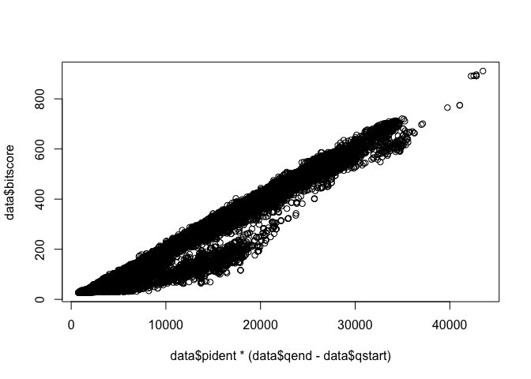
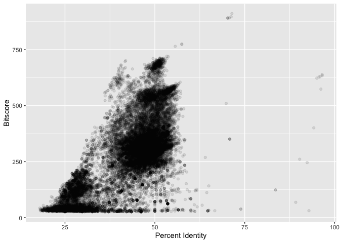
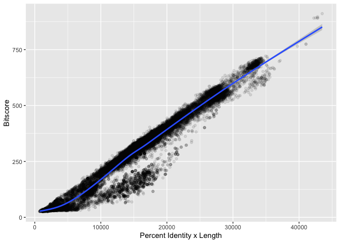

# Class17
Eli Haddad (A16308227)

Data import

``` r
data <- read.csv("mm-second.x.zebrafish.tsv", sep= "\t", col.names= c("qseqid", "sseqid", "pident", "length", "mismatch", "gapopen", "qstart", "qend", "sstart", "send", "evalue", "bitscore"))
```

``` r
plot(data$pident  * (data$qend - data$qstart), data$bitscore)
```



``` r
library(ggplot2)
ggplot(data, aes(pident, bitscore), breaks=30) + geom_point(alpha=0.1) + xlab("Percent Identity") + ylab("Bitscore")
```



``` r
ggplot(data, aes((data$pident * (data$qend - data$qstart)), bitscore)) + geom_point(alpha=0.1) + geom_smooth() + ylab("Bitscore") + xlab("Percent Identity x Length")
```

    Warning: Use of `data$pident` is discouraged.
    ℹ Use `pident` instead.

    Warning: Use of `data$qend` is discouraged.
    ℹ Use `qend` instead.

    Warning: Use of `data$qstart` is discouraged.
    ℹ Use `qstart` instead.

    Warning: Use of `data$pident` is discouraged.
    ℹ Use `pident` instead.

    Warning: Use of `data$qend` is discouraged.
    ℹ Use `qend` instead.

    Warning: Use of `data$qstart` is discouraged.
    ℹ Use `qstart` instead.

    `geom_smooth()` using method = 'gam' and formula = 'y ~ s(x, bs = "cs")'


